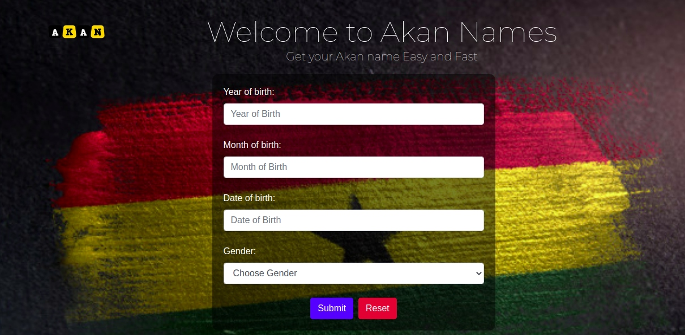

# AKAN NAMES

This is a web application that uses the user's input data which is 
their birth dates to automatically generate Akan names, traditional
naming system of the Ghanians, depending on the day of the of the week
they were born.

## AUTHOR
[Andrew John](https://andyjohn23.github.io/portfolio-repo/)

## SNEAK PEAK

[AKAN](https://andyjohn23.github.io/akan-repo/)

## SETUP INSTRUCTIONS

1. open the terminal(ctrl + alt + T)
1. git clone https://github.com/andyjohn23/akan-repo.git
1. cd akan-repo
1. code . in the terminal to open visual studio code

## BDD
After navigating to the akan web application you will need to fill
the form so as to see your akan name, you wil first:
1. Enter year of birth
1. Enter month of birth
1. Enter date of birth
1. Enter gender either male or female
1. click submit
The information entered is validated to check whether details entered is correct,
if any of the details is entered wrongly then an error message pops up stating you must
fill correct details, if details are correct the a message pops up showing you the day of
the week you were born and your Akan name.

## TECHNOLOGY USED
1. HTML
1. CSS
1. BOOTSTRAP
1. JAVASCRIPT

## CONTACT INFORMATION
For any queries contact [andrewnick906@gmail.com]

## LICENSE AND COPYRIGHT
* MIT LICENSE
* Copyright@2020 Andrew John 